  <a href="README.md"><strong>🌍 English</strong></a>
  &nbsp;|&nbsp;
  <a href="README.lt.md"><strong>🇱🇹 Lietuvių</strong></a>

 

<!-- ORIGINALUS LIETUVIŠKAS CYBERPUNK CAPSULE BANERIS -->

  

<!-- KIBERNETINIS LANGINIS ĮĖJIMO TAŠKAS -->

  

<!-- PAGRINDINIAI PALEIDIMO MYGTUKAI -->

  
  
  

<!-- LIETUVIŠKAS FLUORESCENTINIS CYBERPUNK TYPING BANERIS -->

  

  <strong>Saugumui orientuotas sistemų inžinierius • Gedimams atsparus projektavimas • Produkcija virš teorijos • Tęstinumas virš patogumo</strong>

  <em>Aš kuriu sistemas, kurios sugenda saugiai, o ne tyliai.</em>

<!-- PROFILIO PERŽIŪROS + ŽENKLELIAI -->

  
  
  

---

## Terence Lewis

📍 **Londonas, Anglija • Nuotoliniu būdu / Tarptautinis**

---

## 🧠 Asmeninis profilis

Projektuoju ir kuriu saugumui orientuotas, gedimams atsparias sistemas — ne demonstracinius projektus, ne pamokas ir ne trumpalaikius prototipus.

Mano darbas skirtas realaus pasaulio platformoms, kur nutrūksta ryšys, atsiranda daliniai gedimai, pasenę duomenys ir žmogiškos klaidos — ir tai yra numatyta, o ne ignoruojama.

Aš ne tik padarau, kad sistema veiktų.

Aš projektuoju, kaip ji sugenda, atsistato ir išlieka stebima bei valdoma esant stresui.

---

## 🏗 Ką darau

- Projektuoju gedimams atsparias, saugias sistemas
- Kuriu valdymo sluoksnius, autoriteto modelius ir saugumo ribas
- Kuriu full-stack platformas realioms sąlygoms
- Diegiu stebimas, derinamas ir atkartojamas sistemas
- Projektuoju tęstinumui, o ne idealioms sąlygoms

---

## 🏢 Ką šiuo metu valdau

- **Aurora Logistical Eco Holdings Limited** — Jungtinės Karalystės technologijų įmonė, kurianti aplikacijas, svetaines, individualius programinius sprendimus, skaitmenines sistemas ir tyrimų infrastruktūrą.

- **Lietuviška UAB žemės veikla** — įmonė, valdanti žemę privačioms poilsio kabinoms, kur visas susijusias sistemas projektuoju ir valdau nuo pradžios iki pabaigos.

- **Code Strategy Solutions (CSS)** — vidinė „Aurora“ programinės strategijos ir studijų grupė, skirta programų struktūrai, techniniam mokymuisi, prototipų sistemoms ir praktinei kodavimo strategijai.

- **Bridge IT** — vidinė mokymosi ir sistemų vystymo sistema, skirta sujungti tyrimų idėjas, programinę praktiką ir viešai pateikiamus techninius produktus.

- **WaterFallsLT** — mano viešasis tyrimų, rašymo ir medijos identitetas Substack, Instagram, GitHub eksperimentuose ir techninėje leidyboje.

---

## 🚀 Pagrindinės platformos

### 🏕 CabinApp — privačių kabinų platforma

Reali, veikianti svetingumo sistema.

**Funkcijos:**

- Klientų rezervavimo patirtis
- Savininko / administratoriaus skydelis
- Backend API ir duomenų bazės logika
- Automatizacija ir vidiniai įrankiai
- Sukurta kaip verslo sistema, ne prototipas

---

### 🕸 Harness — saugumui orientuota valdymo ir mesh tinklų platforma

Modulinė valdymo sistema, sukurta remiantis gedimų modeliais, autoriteto atskyrimu ir tęstinumo principais.

**Pagrindinės sritys:**

- Formalios būsenų mašinos: `SAFE_IDLE`, `ARMED`, `ESTOP`
- Komandų senėjimas, „heartbeat“ signalai ir „watchdog“ mechanizmai
- Autoriteto arbitražas: žmogus prieš autonomiją
- „Kill path“ mechanizmai ir saugios būsenos degradacija
- Mesh tipo relinių tinklų koncepcijos didesniam veikimo nuotoliui
- Daugiakanalė komunikacija: Wi-Fi, Bluetooth ir RF tipo ryšiai
- „Dead-stop“ situacijų eliminavimas
- Atkuriami komandų srautai ir post-mortem analizė

Tai nėra žaislinis projektas.

Tai sistemų inžinerijos darbas, skirtas nuspėjamam programinės įrangos elgesiui tada, kai viskas pradeda eiti ne pagal planą.

---

## 📌 Prisegtų repozitorijų aprašymai

### CabinApp

Full-stack svetingumo platforma — rezervavimas, administravimas, API, automatizacija ir realios operacijos.

### Harness

Saugumui orientuota valdymo ir mesh tinklų platforma, orientuota į gedimų modelius, autoriteto modeliavimą ir tęstinumu paremtą sistemų projektavimą.

### Code Strategy Solutions

Vidinė „Aurora“ programinės strategijos ir vystymo sistema, skirta praktiniams kodavimo sprendimams, prototipų projektavimui, struktūruotam mokymuisi ir pakartotinai naudojamiems techniniams modeliams.

### Aurora Logistical Eco Holdings Website

Pagrindinė statinė įmonės svetainė ir GitHub Pages vykdymo aplinka, skirta „Aurora Logistical Eco Holdings Limited“, su skaitmeninės knygos paleidimo struktūra, tyrimų archyvo maršrutais ir Substack paleidimo aikštelės integracija.

### RPSLS — Rock-Paper-Scissors-Lizard-Spock

JavaScript projektas, parodantis švarią logiką, būsenos valdymą ir plečiamą front-end struktūrą.

### Utilities / Portfolio

Produkciniai įrankiai, eksperimentai ir pakartotinai naudojami komponentai, naudojami realiuose projektuose.

---

## 🎓 Kvalifikacijos

- City & Guilds — ICT Systems & Principles (3 lygis)
- Code Institute — 5 dienų programavimo iššūkis

**Nuolatinis savarankiškas tobulėjimas:**

- Sistemų architektūra
- Valdymo ir saugumo modeliavimas
- Full-stack platformos
- API ir duomenų bazės
- Produkciniai procesai
- Programinės strategijos kūrimas
- Skaitmeninių sistemų projektavimas

---

## 🌐 Susisiekime

  
  
  
  
  

---

## 🛠 Kalbos ir įrankiai

  
  
  
  
  
  
  
  
  
  
  
  
  
  

**Pagrindinės sritys:**

- Sistemų architektūra
- Saugumui orientuotas projektavimas
- Gedimams atspari inžinerija
- Full-stack platformos
- API ir duomenų bazės
- Statinių svetainių diegimas
- GitHub Pages
- Skaitmeninių sistemų projektavimas
- Produkciniai procesai

---

## 📊 GitHub statistika

  
  

  

---

## 🌍 Darbo stilius

- Saugumas pirmoje vietoje
- Gedimams atsparus projektavimas
- Sistemos vietoje trumpų sprendimų
- Tęstinumas vietoje patogumo
- Kuriu stresui, ne demonstracijoms
- Ilgaamžiškumas virš greitų sprendimų
- Stebimos sistemos vietoje tylių gedimų
- Atsistatymo keliai vietoje optimistinių spėlionių

---

## 🔗 Vieninga istorija

Šis GitHub profilis dera su mano CV, LinkedIn, Aurora Logistical Eco Holdings Limited, Code Strategy Solutions, Bridge IT ir WaterFallsLT:

- Kūrėjas, ne mokinys
- Savininkas, ne rangovas
- Sistemos, ne fragmentai
- Produkcija, ne teorija
- Saugumas, ne greitis
- Tęstinumas, ne patogumas
- Gedimams atsparus projektavimas vietoje trapaus optimizmo

Aš kuriu sistemas, kurios sugenda saugiai, o ne tyliai.

Aš neprojektuoju idealioms sąlygoms.

Aš projektuoju realiam pasauliui.

Kur viskas lūžta.

Kur ryšys dingsta.

Kur žmonės klysta.

Kur sistemos turi gesti saugiai.

---

  

